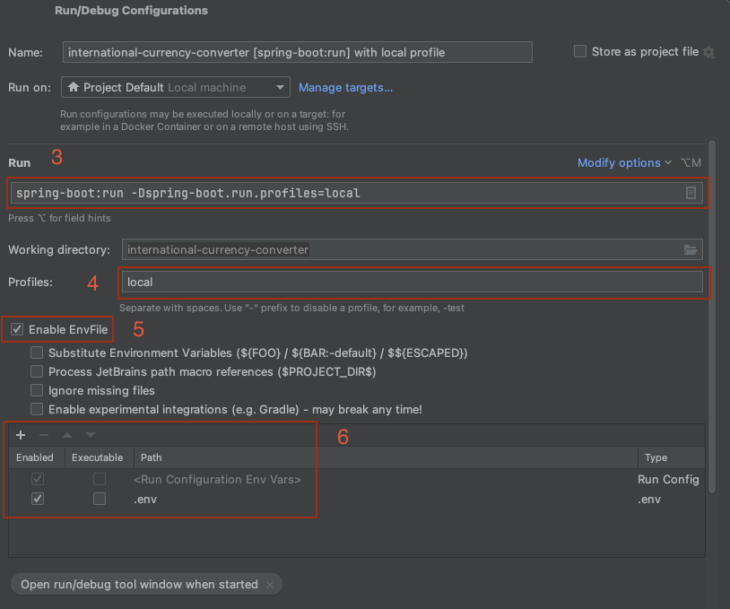

# International Currency Converter

A Java-based application for converting currencies when shipping products across borders with import duty rates and import tax rates calculated. 

## Table of Contents
- [Introduction](#Introduction)
- [Features](#Features)
- [Technologies](#Technologies)
- [Installation](#Installation)
- [Deploying to railway using GitHub Actions](#Deploying-to-railway-using-GitHub-Actions)
- [Usage](#Usage)

## Introduction

The International Currency Converter is designed to help users calculate final cost of products sold between borders, including currency exchange rate, duty rate, and tax rate. The application is built using Spring Boot and utilizes Netflix's DGS framework for GraphQL Query's and Mutation's.

## Features

- Convert amount between different currencies.
- Able to update currencies with live data from an external API.
- Starts with multiple currencies including USD, EUR, GBP, JPY, CHF, and CAD.
- Add/Modify Currency pairs with conversion rates as needed
- Add/Modify Products with price and currency codes as needed
- Add/Modify Countries with currency codes as needed
- Calculate Landed Cost of a product from one country to another

## Technologies

- Java
- Spring Boot
- Hibernate
- PostgreSQL
- Docker
- Railway for deployment
- GraphQL

## Installation

### Prerequisites

- Java 21 or higher
- Maven
- Docker

### Initial setup

1. Clone the repository to your local machine:
   ```bash
   git clone https://github.com/mike-jacks/international-currency-converter.git
   cd international-currency-converter

### Create a \`.env\` file

1. Using the provided \`*.env.example*\` file, make a copy of it called \`*.env*\`:

   ```env
   cp .env.example .env

2. Within the .env file, please modify the following variable values to your preference:

   ```env
   POSTGRES_USER=your-postgres-user
   POSTGRES_PASSWORD=your-postgres-password
   POSTGRES_DB=your-local-database-name

### Get and add a FreecurrencyAPI Key
1. Go to [FreecurrencyAPI](https://freecurrencyapi.com) and create an account
2. Replace \`FREECURRENCY_API_KEY\` value in your \`.env\` with your new API key displayed on the [FreecurrencyAPI](https://freecurrencyapi.com) dashboard
   ```env
   FREECURRENCY_API_KEY=<paste-your-freecurrency-api-key-here>

### Build and deploy Postgres and backend app Docker Containers
1. Within a terminal session in the root directory of your project, run the following command:

    ```bash
    docker-compose up -d
   
2. You should now have a working backend program to connect to.  
To test the GraphQL API, navigate your web browser to the following url:  
   **[http://localhost:8081/graphiql](http://localhost:8081/graphiql)**

### Configure IntelliJ IDEA to run locally for debugging
1. Go to \`run\` in the menu bar of IntelliJ IDEA app and go to \`Edit Configurations...\`
2. Click the \`+\` button to add a \`Maven\` configuration.
3. In the \`run\` command field, enter the following
   ```
   spring-boot:run -Dspring-boot.run.profiles=local
4. Add \`local\` to the Profiles field
5. Check \`Enable EnvFile\` and use the \`+\` button to add your \`.env\` file



6. You should now be able to run locally and with docker at the same time. To access the local version of your program in your browser go to:  
   **[http://localhost:8080/graphiql](http://localhost:8080/graphiql)**  
At the same time if the docker app is still running, you can access the Docker version here:  
   **[http://localhost:8081/graphiql](http://localhost:8081/graphiql)**

## Deploying to railway using GitHub Actions

### Initial setup

1. Fork the GitHub repository to your own repository
2. Clone the repository to your local machine
3. Login and create a blank new project in [railway.app](https://railway.app)
4. On your Dashboard, right click and select \`Database\` under \`Add New Service\`
5. Add PostgreSQL
6. On your Dashboard, right click and select \'Empty Service\` under \`Add New Service\`
7. You should now have two services available, a Postgres and a Backend container. Go ahead and deploy both of them for now.

### Setup Env Variables in Railway

1. Select your backend service and go to the \`Variables\` tab
2. Select \`RAW Editor\` and past the following variables from your .env file:
   ```env
   POSTGRES_HOST_RAILWAY=${{Postgres.PGHOST}}
   POSTGRES_PORT_RAILWAY=${{Postgres.PGPORT}}
   POSTGRES_USER_RAILWAY=${{Postgres.POSTGRES_USER}}
   POSTGRES_PASSWORD_RAILWAY=${{Postgres.POSTGRES_PASSWORD}}
   POSTGRES_RAILWAY_DB=${{Postgres.POSTGRES_DB}}
   
   LOCALIZATION_GRAPHQL_ENDPOINT=http://localhost:8080/graphql
   
   FREECURRENCY_API_KEY=your-freecurrency-api-key
   FREECURRENCY_API_URL_HOST=https://api.freecurrencyapi.com/v1/latest?apikey=
3. Add a variable \`PORT\` and assign it to value \`8080\`
   ```env
   PORT=8080
4. Add a variable \`SPRING_PROFILES_ACTIVE\` and assign to value \`railway\`
   ```env
   SPRING_PROFILES_ACTIVE=railway
5. Add a variable \`RAILWAY_DOCKERFILE_PATH\` and assign to value \`Dockerfile.railway\`
   ```env
   RAILWAY_DOCKERFILE_PATH=Dockerfile.railway
6. Change \`LOCALIZATION_GRAPHQL_ENDPOINT\` to this:
   ```env
   LOCALIZATION_GRAPHQL_ENDPOINT=http://${{RAILWAY_PRIVATE_DOMAIN}}:${{PORT}}/graphql
7. Confirm your specific \`FREECURRENCY_API_KEY\` key is still applied.


### Setup GitHub to connect and deploy to your app through GitHub Actions

1. Back on your railways.app project screen, select \`Settings\` in the top right corner. This is for this specific project settings. Do not select \`Account Settings\`.
2. Go to \`Tokens\` tab and create a new Token called \`GITHUB_ACTIONS_DEPLOY\`
3. Copy the token value provided, you will only be able to see this once! If you forget it or lose it before adding to GitHub you will need to delete it and create another one.
4. In a new browser window, navigate to your GitHub repository. 
5. Under \`Settings\` tab, go to \`Secrets and variables\` > \`Actions\`
6. Click the button \`New repository secret\` and create a secret with the name \`RAILWAY_TOKEN\` and paste the copied value into the \`Secret\` field box
7. Go back to Railway.app and select your Backend service.
8. Go to \`Variables\` and show the \`Railway Provided Variables available\`
9. Create 3 more secrets in GitHub, similar to \`RAILWAY_TOKEN\`, for the following variables:
   - RAILWAY_SERVICE_ID
   - RAILWAY_PROJECT_ID
   - RAILWAY_ENVIRONMENT_ID
10. Make sure on GitHub you name the variables the exact same. 
11. You should now be set with GitHub actions and railway. 
12. Everytime you commit to the \[main\] branch in your repository, it will run the GitHub actions to validate tests then deploy to railway.app

### Accessing railway app public URL
1. Select your Backend service on railway.app and go to \`Settings\`
2. Under \`Networking > Public Networking\` select \`Generate Domain\`
3. A custom domain will be generated, and you can use that to access your deployed hosted backend application.

## Usage
### Accessing the GraphiQL interface
1. Depending which version/s you have running, navigate to one of the following URLS:
   - Local Version: [http://localhost:8080/graphiql](http://localhost:8080/graphiql)
   - Docker Version: [http://localhost:8081/graphiql](http://localhost:8080/graphiql)
   - Railway Version: https://your-custom-railway-domain.up.railway.app/graphiql

### Example GraphQL Queries 
Below are some of the GraphQL Queries you can do.
#### Get All Currencies
   ```graphql
   query {
     currencies {
       id
       baseCode
       targetCode
       conversionRate
     }
   }
   ```

#### Get All Products
   ```graphql
   query {
     products {
       id
       name
       price
       currencyCode
     }
   }
   ```

#### Get All Countries
   ```graphql
   query {
     countries {
        id
        name
        code
        dutyRate
        taxRate
     }
   }
   ```
#### Update Currency Rate to Live Data by Id
   ```graphql
   mutation {
     updateCurrencyRateToLiveById(currencyId: "some-uuid-number") {
        id
        baseCode
        targetCode
        conversionRate
     }
   }
   ```
Please see the documentation on the \`graphiql`\ interactive page for more query/mutation options.
